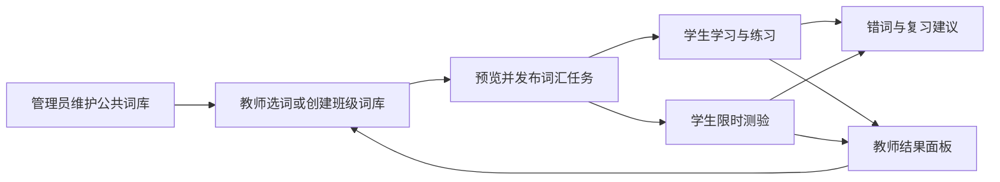

# 背单词模块总体规划与设计

> 设计日期：2026-10-01。状态：**P0 闭环已实现**（词库/CSV 导入预览/发布快照/看义拼词+听音拼词练习/确定性判分/错词本/班级完成统计/三端适配；实现说明见 CLAUDE.md「背单词模块」章节）。P1（限时测验/截止强制/重做策略/导出）与 P2（间隔复习/掌握度）待排期。目标是在现有 SpeakUp 口语模块旁增加独立的「词汇学习」模块，共用账号、课堂、学生名单与基础设施。

## 1. 设计依据与边界

现有系统定位为教师主导的课堂教学工具，已有 `User`、`Classroom`、`Student`、课堂练习发布快照、模考计时与切屏记录、学生成长页。管理端的 `WordlistEntry(lemma, band)` 只用于口语问答的词汇分析，导入时整表替换，缺少释义、词性、音频和教材组织信息，**不能直接充当背词题库**。新增词汇教学数据，保留原词表的分析职责。

参考 [Spellix 演示平台](https://iecgiwfqkoij.sealosbja.site/) 的 demo 学生端，已观察到：首页的练习/考试入口与词库概览、教师任务、只读在线词库和配置、错词本、学习报告、会话详情入口及 AI 学习洞察。演示账号未提供可核验的教师后台流程。参考的是功能闭环，视觉、导航、评分与防作弊规则按本项目另行设计。

**产品目标**：老师在课前建立或选取词库，在课堂发布词汇任务；学生完成学习、练习或测验；老师看到完成率与具体薄弱词，并据此安排复习。课后可自主复习，但不以连续打卡替代课堂任务。

**不在首版做**：独立账号体系、复制一套课堂管理、AI 自动判拼写、公开排名、教材原文自动抓取、把前端全屏状态当成可靠监考证据。

## 2. 用户体验与信息架构

| 角色 | 主要页面 | 主要动作 |
| --- | --- | --- |
| 学生 | 学习首页、词汇任务、词库浏览、错词复习、词汇报告 | 看本班任务，听音/看义回忆，键入拼写，查看反馈与进步 |
| 教师 | 课堂内「口语 / 词汇」分区、词库、词汇任务、结果 | 选词、预览、发布、查看完成和错词分布、安排下一轮 |
| 管理员 | 公共词库管理 | CSV 导入、校验、版本管理、归档；供教师选用 |

学生首页展示「口语练习」和「词汇学习」两个并列入口。现有手机底部导航已占四个位置，改为「首页 / 口语 / 词汇 / 成长」；主题探索收进「口语」，课堂信息和帮助收进次级菜单。iPad 和桌面侧栏可直接展示词库、任务、错词本。教师仍以「我的课堂」为一级入口，课堂内切换口语和词汇，避免再建一套班级。

### 学生流程

1. 进入课堂后看到今天的口语与词汇任务，各自有截止时间和完成状态；没有任务时可自主复习已开放词库。
2. 学习页一次聚焦一个词：英文、词性、中文释义、可用的音频、例句；先主动回忆，再揭示答案。英文定义和例句可后续补充，不以它们作为首版导入门槛。
3. 练习支持「看义拼词」和「听音拼词」。无可用音频的词不进入听音题，页面明确提示原因；不把浏览器 TTS 作为考试唯一标准音。
4. 每题提交后给出确定性对错、标准拼写和释义。错词自动进入复习列表；练习允许重试，测验结束前不透露逐题答案。
5. 任务完成后显示题量、正确数、正确率、用时及需复习的词；个人报告可查看历史趋势和错词变化。

### 教师流程

1. 选择公共词库或创建班级词库，可按单元、标签、关键词筛选；导入预览显示有效、重复、缺字段及冲突行。
2. 创建任务时选课堂、词条、题型、题量、顺序、模式、开放与截止时间；测验可选时限、作答次数和公布答案时间。
3. 发布前预览实际题目与词条数量。发布生成**不可变快照**；此后改词库不改变正在进行的任务或历史报告。若要改内容，创建新版本并明确对未开始学生的影响。
4. 结果面板按「已完成 / 进行中 / 未开始」统计，逐词显示错误人数和常见误拼，支持查看某学生的作答。仅本班教师和管理员可看。

## 3. 功能优先级

| 阶段 | 交付内容 | 验收重点 |
| --- | --- | --- |
| P0 闭环 | 独立词库、CSV 导入与预览、教师发布快照、学生看义拼词/有音频时听音拼词、确定性判分、错词本、班级完成统计、三端适配 | 一个班级能从导入到发布、作答、看结果完整跑通 |
| P1 教学完善 | 限时测验、截止时间、重做策略、重新发布版本、单词级统计、教师导出结果 | 课堂测验和课后练习规则清晰，历史结果可追溯 |
| P2 个性化复习 | 固定间隔复习（建议 1/3/7/14 天）、掌握度、跨任务错词聚合、内容音频批量处理 | 复习队列可解释、教师任务始终优先 |
| P3 可选增强 | AI 辅助生成例句/学习建议、更多题型、与口语任务按单元联动 | AI 内容须审核，建议引用真实作答，不虚构掌握度 |

P0 的「词库」是教师教学内容；P2 的「掌握度」是学生学习状态。两者分开，避免因教师修改词库导致学生历史消失。

## 4. 内容与数据模型

建议新增下表，名称可在实现时按仓库规范调整：

| 对象 | 关键字段与约束 | 用途 |
| --- | --- | --- |
| `VocabularyWord` | `id`, `headword`, `part_of_speech`, `meaning_zh`, `meaning_en?`, `accepted_spellings[]`, `example_en?`, `audio_url?`, `status` | 一条可考的词义；同形异义可以有不同 ID；音频来源与授权需记录 |
| `VocabularyBook` | `id`, `title`, `description`, `scope`(public/classroom), `owner_id?`, `classroom_id?`, `unit_id?`, `version`, `status` | 公共或班级词库；与现有 `Unit` 可选关联 |
| `VocabularyBookItem` | `book_id`, `word_id`, `position`，组合唯一 | 词库有序内容；同一书不重复收词条 |
| `VocabularyAssignment` | `id`, `classroom_id`, `created_by`, `title`, `mode`, `settings`, `snapshot_items`, `version_no`, `opens_at?`, `due_at?`, `status` | 教师发布版本；快照存词、释义、可接受拼写、不可覆盖的音频版本和题型规则 |
| `VocabularyAssignmentTarget` | `assignment_id`, `student_id`，组合唯一 | 发布时固定目标学生名单，完成率分母不因后续入班漂移；迟入班学生可由教师补派 |
| `VocabularySession` | `id`, `assignment_id?`, `student_id`, `mode`, `status`, `started_at`, `submitted_at?`, `time_limit?`, `tab_switch_count` | 一次作答；考试开始/截止由服务端时间判定 |
| `VocabularyAnswer` | `session_id`, `item_index`, `attempt_no`, `prompt_type`, `answer_raw`, `answer_normalized`, `is_correct`, `answered_at`，三元组唯一 | 可审计的原始作答与判分；练习保留多次尝试，测验仅允许首答 |
| `VocabularyMastery`（P2） | `user_id`, `word_id`, `last_result`, `next_review_at`, `interval_days`, `correct_streak` | 跨课堂个人复习状态；教师只可看自己班级的任务与作答 |

词库更新采用版本或归档，不做原词表的「整表替换」。任务发布、目标名单、题量与快照写入同一事务；历史提交永远按 `snapshot_items` 判分和展示。学生在多个课堂的任务分别绑定 `Student` 档案；将来跨课堂个人复习才按 `User` 汇总，并限制教师只能访问自己班级的数据。

## 5. 判分、任务和安全规则

- **拼写判定**：服务端对输入做 Unicode 规范化、首尾空白清理和大小写折叠；只接受题目快照中的标准拼写及明确配置的变体。连字符、撇号、复数、英美拼法不自动放宽。拼错显示差异提示，但不调用大模型决定对错。
- **音频来源**：优先使用教师上传或已授权的标准音，记录版本与来源；练习可用浏览器朗读兜底并标明「设备合成语音」。测验的听音题必须有稳定的标准音，否则发布校验阻止该题型。
- **计数口径**：练习正确率 = 首答正确题数 / 已作答题数；测验得分率 = 首答正确题数 / 必答题数，未答题按 0 分处理。完成率 = 完成全部必答题的学生数 / 目标学生数。零作答显示「未作答」而非伪装成 0% 准确率；超时、取消单列。报告显示统计范围与时间。
- **练习**：可重试；首答和最终答分别保存，教师统计默认看首答，以免反复试错冲高正确率。
- **测验**：每题只提交一次，服务端限时和截止时间为准；提交接口需幂等键，断网重发返回同一结果。到时自动结算未答题；答案可在统一公布时间后查看。发布时核对「所选词数、可出题数、最终题数」，不允许配置题量超过实际可出题量。
- **切屏记录**：沿用现有模考的 `visibilitychange` 记录思路，标记「切屏次数」供教师参考。全屏和切屏检测不能证明作弊，不自动将测验定性为作弊或给学生贴标签。
- **权限**：词库公共内容允许学生只读；班级词库和任务仅本班成员可读；编辑/发布仅课堂所有者或管理员；原始答案与个人报告仅本人、该班教师和管理员可读。401 只表示登录失效，权限不足用 403。
- **内容合规**：学校教材文本与音频由授权人员导入，仓库只放自写演示数据；不复制参考网站词库到生产库。

## 6. API 与代码落点建议

后端新增 `app/api/routes/vocabulary.py` 和 `app/services/vocabulary/`，由 `app/api/main.py` 注册。沿用同步 `Session`、Pydantic 请求/响应模型、现有账号与课堂授权函数，词汇会话与口语 `PracticeSession` 分表，避免两种练习互相影响。

| 资源 | 建议接口 | 说明 |
| --- | --- | --- |
| 词库 | `GET/POST /api/v1/vocabulary/books`、`GET/PATCH /.../books/{id}`、`POST /.../books/import-preview` | 权限按公共/班级作用域检查；先预览再确认导入 |
| 课堂发布 | `GET/POST /api/v1/classes/{code}/vocabulary/assignments`、`POST /.../assignments/{id}/publish` | 发布时校验并固化快照 |
| 学生任务 | `GET /api/v1/classes/{code}/vocabulary/today`、`POST /.../sessions` | 返回任务及个人状态，创建/恢复会话 |
| 作答 | `POST /api/v1/vocabulary/sessions/{id}/answers`、`POST /.../submit` | 请求含题号与幂等键；服务端判分、编号重试并校验计时 |
| 报告 | `GET /api/v1/classes/{code}/vocabulary/results`、`GET /api/v1/vocabulary/me/wrong-words` | 班级聚合与个人错词 |

实际前缀以现有 `api_router` 约定为准；所有客户端调用经 OpenAPI 生成的 `frontend/src/client/`，不手写 URL。前端建议在学生壳增加 `/vocab/$code` 入口，教师课堂下增加词汇 Tab，管理员新建公共词库页。新文案全部用 `useI18n().t({ zh, en })`；词义数据的语言字段与 UI 双语是两回事。表单字号至少 16px、主要触控目标至少 44px，按 390/820/1180 三档验证。

## 7. 交付顺序与验收

1. **确认样例内容与任务规则**：学校提供可授权使用的 CSV/音频样本；确定词库字段、测验重做/答案公布规则。用自写样例先完成开发，不等待正式教材。
2. **数据与 API**：加模型、Alembic 迁移、权限、导入预览、发布快照、作答及统计；生成前端客户端。
3. **教师与管理端**：词库导入、词条编辑、任务发布预览、结果面板。
4. **学生端**：任务首页、学习/拼写、错词和报告；保留口语模块既有入口及数据。
5. **验证**：隔离测试库 `app_test` 中测导入回滚、同形异义、拼写规范化、权限、截止/超时、重复提交、快照不漂移；端到端走一个 40 人课堂；三端宽度检查。

首版验收场景：管理员导入 20 个自写词条 → 老师为某班发布 10 词练习 → 学生完成并看到错词 → 老师看到完成情况和逐词错误 → 老师修改原词义后，旧任务及报告仍显示发布时内容 → 同一学生的口语练习、成绩和课堂成员关系保持正常。

粗略排期（1 名熟悉现有仓库的全栈开发者、需求与样例内容及时确定）：P0 约 2–3 周，P1 再 1–2 周；P2 约 1–2 周，P3 单独评估。正式教材、音频授权、学校验收和上线部署时间不包含在代码工期内。

## 8. 待产品确认的决定

以下问题不阻碍 P0 技术骨架，但在词库字段与发布页面定稿前需要确定：

1. 学校提供的是单词+中文释义，还是含词性、例句、标准音？教材及音频是否已取得线上使用授权？
2. 首版以「看义拼词 + 听音拼词」为主是否符合课堂目标？是否要求认义选择题或英英释义？
3. 教师可否自建和共享词库，还是全部由管理员统一维护？
4. 测验是否允许重做、何时公布标准答案、成绩是否需要导出到校方系统？

**建议默认值**：教师可建班级词库，管理员管公共词库；练习可重试，测验一次提交；测验结束后统一公布答案；成绩先支持 CSV 导出，不做外部系统对接。
